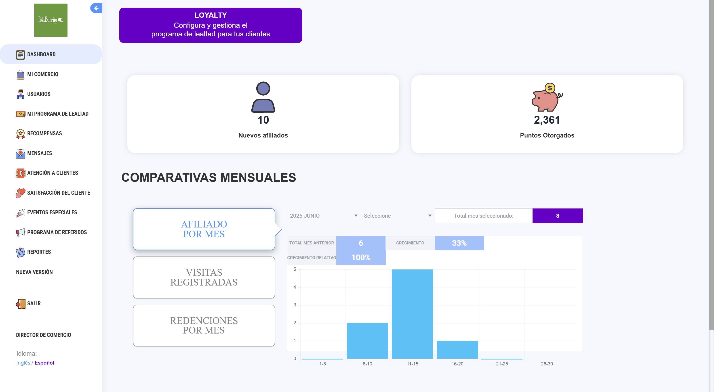
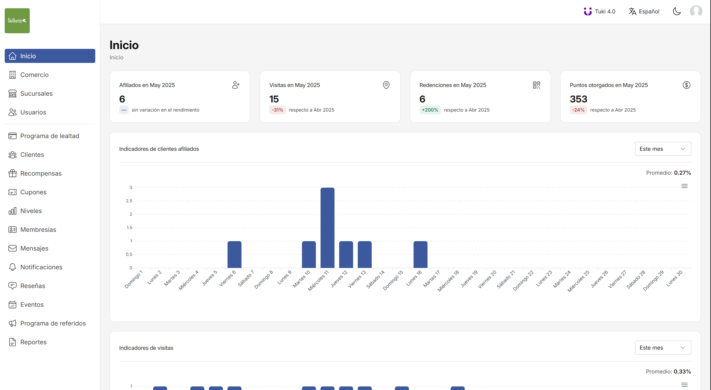
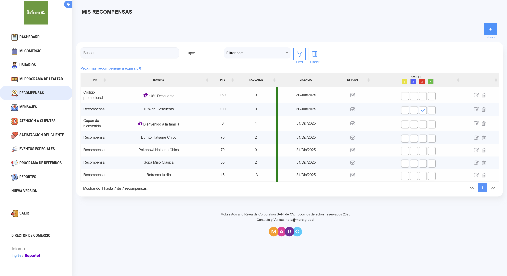
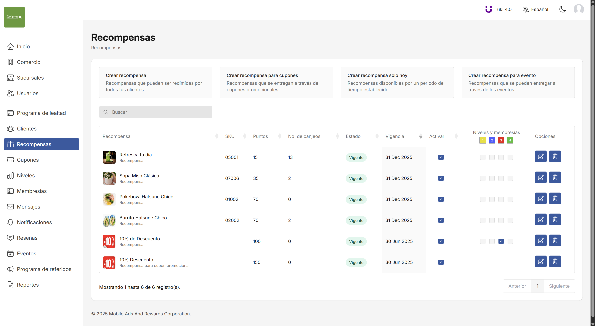
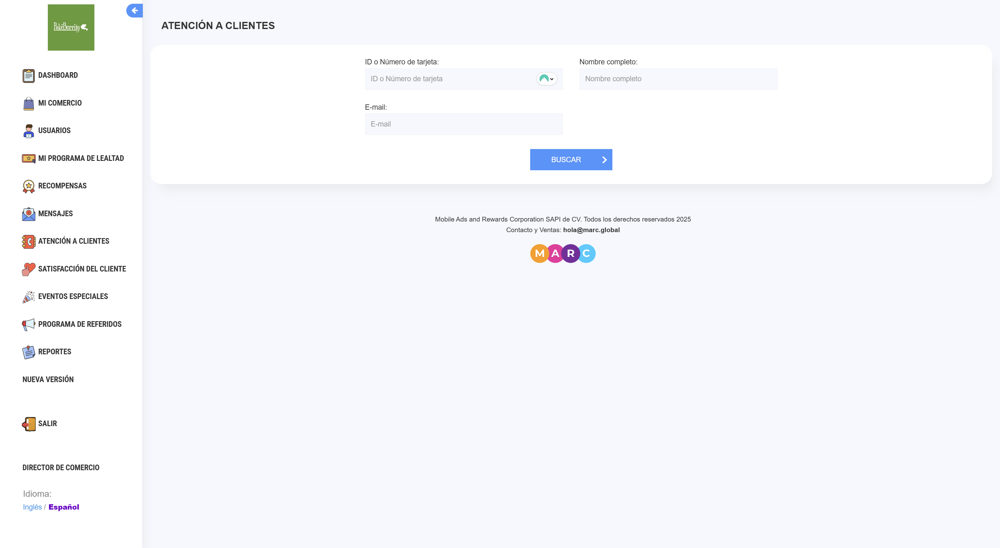
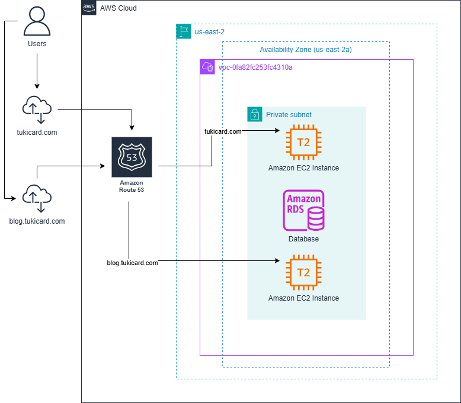
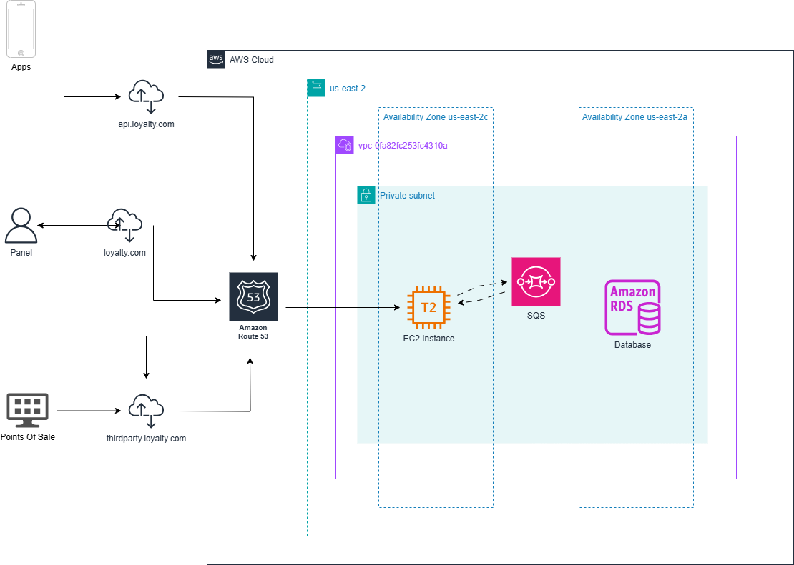

## Sobre mí

👋 Hola, soy Fernando.  
💻 Ingeniero en Sistemas Computacionales con más de 2 años de experiencia en desarrollo de software, principalmente en tecnologías web, móvil y cloud.  
🚀 Me apasiona crear soluciones accesibles, escalables y con experiencias de usuario simples pero potentes.  
📫 Correo electrónico: fernandodefez@outlook.com

---

## Proyectos que he liderado y en los que he participado

### 🚧 Migración y rediseño de la plataforma de lealtad **Tuki**

Lideré la migración de la infraestructura y el rediseño completo de la plataforma de lealtad [**Tuki**](https://tukicard.com/), optimizando su rendimiento, mejorando su accesibilidad y experiencia de usuario, así como su seguridad y escalabilidad.

**Tecnologías utilizadas:**
- **Backend:** PHP, Laravel, PHPUnit, SQL, Linux, Supervisor, Redis, Firebase Cloud Messaging, Twilio SMS, OneSignal
- **Frontend:** HTML, CSS, JavaScript, Axios, jQuery, TailwindCSS, Bootstrap
- **Amazon Web Services:** EC2, RDS, SQS, Route 53
- **Otras:** Docker, Git, Gitlab

**Capturas del rediseño de la plataforma:**

- **Antes del Home**

  

- **Después del Home**

  

- **Antes del módulo de recompensas**

  

- **Después del módulo de recompensas**

  

- **Antes del módulo de clientes**

  

- **Después del módulo de clientes**  

  

**Diagramas diseñados para la migración de la infraestructura de Vultr a Amazon Web Services:**

- **Landing Page y Blog**  

  

- **Plataforma**  

  

---

### 📱 Desarrollo y despliegue de aplicaciones móviles

He participado en el desarrollo y publicación de aplicaciones móviles que consumen los servicios de la plataforma de lealtad de **Tuki**, adaptadas a las necesidades de cada cliente.

**Tecnologías utilizadas:**
- **Mobile:** Solar 2D
- **Otras:** Git, Gitlab, Firebase, OneSignal, Facebook Sign In, Apple Sign In

**Aplicaciones desarrolladas:**

- **Rous:** App multicomercio que permite a los usuarios afiliarse mediante su CURP.
  > [Google Play](https://play.google.com/store/apps/details?id=mx.marc.rous&hl=es_MX)  
  > [App Store](https://apps.apple.com/mx/app/rous/id6471860278)

- **Bubayou:** App de un solo comercio que permite la compra de puntos a través de una pasarela de pago.
  > [Google Play](https://play.google.com/store/apps/details?id=mx.marc.bubayou)  
  > [App Store](https://apps.apple.com/mx/app/bubayou/id15118202511)

- **Bertha's:** App de un solo comercio que permite la compra de membresías por parte de los afiliados.
  > [Google Play](https://play.google.com/store/apps/details?id=mx.marc.berthas)  
  > [App Store](https://apps.apple.com/mx/app/berthas-movil/id6498956986)

- **Puntos Trotters:** App multicomercio que permite registrar visitas y redimir puntos en puntos de venta.
  > [Google Play](https://play.google.com/store/apps/details?id=mx.marc.trotters)  
  > [App Store](https://apps.apple.com/mx/app/puntos-trotters/id1569454354)

- **Engow:** App para incentivar tanto a afiliados como a empleados de los comercios mediante dinámicas de puntos y recompensas.
  > [Google Play](https://play.google.com/store/apps/details?id=mx.marc.engow)  
  > [App Store](https://apps.apple.com/mx/app/engow/id1475277688)

> Todas las aplicaciones soportan las funcionalidades básicas de un programa de lealtad: acumulación de puntos por visitas, canje de recompensas, cupones, personalización, niveles, comunicación y reportes. Lo que se destaca son las funcionalidades específicas que cada cliente solicitó.

---

### 🚧 Desarrollo de la primera fase de **Creativo Lab**, una plataforma que permite gestionar el contenido de plantillas de perfiles profesionales

Llevé a cabo el desarrollo de la primera fase de esta plataforma. Dicha fase involucró la creación de la landing page, el panel administrativo y la REST API para su versión móvil.

**Tecnologías utilizadas:**
- **Backend:** PHP, PHPUnit, MySQL, Linux
- **Frontend:** HTML, CSS, JavaScript, jQuery, Bootstrap
- **Otras:** Git, Gitlab, Docker

🔗 [Visitar](https://dev.creativolab.com.mx/)

---

## 🚀 Proyectos personales / Side projects

### 💡 Gestor de tareas (App de escritorio)

Desarrollé una aplicación de escritorio para la gestión sencilla de tareas. Este proyecto me permitió poner en práctica los conceptos de Programación Orientada a Objetos y el patrón de diseño MVC, en el lenguaje de programación con el que más cómodo me siento.

**Tecnologías utilizadas:**
- Java
- JUnit
- SQLite
- Maven

**Código fuente del proyecto:**  
🔗 [Ver en GitHub](https://github.com/fernandodefez/task-manager-desktop-app-with-java)

---

<!---
fernandodefez/fernandodefez is a ✨ special ✨ repository because its `README.md` (this file) appears on your GitHub profile.
You can click the Preview link to take a look at your changes.
--->
